# Luca Scripts

This document provides visual documentation for the scripts supporting Luca.

---

## 1. System Overview

This diagram shows how all the scripts relate to each other and their role in the Luca ecosystem.

```mermaid
flowchart TB
    subgraph User["👤 User Actions"]
        U1[Run install.sh]
        U2[Change directory in terminal]
        U3[Git checkout/switch branch]
        U4[Run uninstall.sh]
    end

    subgraph Scripts["📜 LucaScripts"]
        IS[install.sh]
        SH[shell_hook.sh]
        PC[post-checkout]
        UN[uninstall.sh]
    end

    subgraph Artifacts["📦 Installed Artifacts"]
        EXE["/usr/local/bin/luca"]
        HOOK["~/.luca/shell_hook.sh"]
        GITHOOK[".git/hooks/post-checkout"]
        RCFILE["~/.bashrc or ~/.zshrc"]
    end

    subgraph Runtime["⚡ Runtime Behavior"]
        PATH["PATH management"]
        SYNC["Tool synchronization"]
    end

    U1 --> IS
    IS -->|downloads & installs| EXE
    IS -->|downloads| HOOK
    IS -->|modifies| RCFILE
    IS -->|optionally installs| GITHOOK

    U2 --> SH
    SH --> PATH
    PATH -->|adds/removes| .luca/active

    U3 --> PC
    PC -->|may call| IS
    PC -->|runs| SYNC
    SYNC -->|"luca install"| EXE

    U4 --> UN
    UN -->|removes| EXE
    UN -->|removes| HOOK
    UN -->|cleans| RCFILE
```

---

## 2. Installation Flow (`install.sh`)

Detailed flowchart of what happens when you run the installation script.

```mermaid
flowchart TD
    Start([Start install.sh]) --> CheckVersion{".luca-version<br/>exists?"}
    
    CheckVersion -->|Yes| ReadVersion[Read version from file]
    CheckVersion -->|No| FetchLatest[Fetch latest from<br/>GitHub API]
    
    ReadVersion --> ValidateSemVer{Valid SemVer?}
    FetchLatest --> ValidateSemVer
    
    ValidateSemVer -->|No| ErrorExit1([❌ Exit: Invalid version])
    ValidateSemVer -->|Yes| DetectOS{Detect OS}
    
    DetectOS -->|macOS| SetMacZip[Set: Luca-macOS.zip]
    DetectOS -->|Linux| SetLinuxZip[Set: Luca-Linux.zip]
    DetectOS -->|Other| ErrorExit2([❌ Exit: Unsupported OS])
    
    SetMacZip --> CheckExisting
    SetLinuxZip --> CheckCurl{curl installed?}
    
    CheckCurl -->|No| InstallCurl[Install curl via<br/>apt-get/yum]
    CheckCurl -->|Yes| CheckExisting
    InstallCurl --> CheckExisting
    
    CheckExisting{Luca already<br/>installed?}
    CheckExisting -->|Yes| CompareVersion{Same version?}
    CheckExisting -->|No| Download
    
    CompareVersion -->|Yes| SkipExit([✅ Exit: Already up to date])
    CompareVersion -->|No| Download
    
    Download[📥 Download ZIP from<br/>GitHub releases] --> Extract[📦 Extract ZIP]
    Extract --> InstallBin[🚀 Move to /usr/local/bin<br/>chmod +x]
    
    InstallBin --> SetupHook[🔧 Setup Shell Hook]
    
    subgraph ShellHookSetup["Shell Hook Setup"]
        SetupHook --> CreateDir[Create ~/.luca/]
        CreateDir --> DownloadHook[Download shell_hook.sh]
        DownloadHook --> SourceHook[Source shell_hook.sh]
        SourceHook --> ModifyRC[Add to ~/.bashrc<br/>or ~/.zshrc]
    end
    
    ModifyRC --> GitHook{In git repo?}
    
    subgraph GitHookSetup["Git Hook Setup (Optional)"]
        GitHook -->|Yes| CheckHookExists{post-checkout<br/>exists?}
        GitHook -->|No| Complete
        CheckHookExists -->|No| InstallGitHook[Download & install<br/>post-checkout hook]
        CheckHookExists -->|Yes, ours| SkipGitHook[Already installed]
        CheckHookExists -->|Yes, other| WarnGitHook[⚠️ Warn: manual merge needed]
        InstallGitHook --> Complete
        SkipGitHook --> Complete
        WarnGitHook --> Complete
    end
    
    Complete([🎉 Installation Complete])
```

---

## 3. Shell Hook Mechanism (`shell_hook.sh`)

How the shell hook manages PATH dynamically as you navigate directories.

```mermaid
flowchart TD
    subgraph Initialization["🔧 Initialization (on shell start)"]
        Source[Shell sources<br/>~/.luca/shell_hook.sh] --> RegisterHook{Detect shell type}
        RegisterHook -->|Bash| AddPrompt["Add update_path to<br/>PROMPT_COMMAND"]
        RegisterHook -->|Zsh| AddPrecmd["Add update_path to<br/>precmd hook"]
        AddPrompt --> InitialUpdate[Run update_path<br/>for current dir]
        AddPrecmd --> InitialUpdate
    end

    subgraph EveryPrompt["⚡ Before Every Prompt"]
        Prompt[User presses Enter<br/>or changes directory] --> UpdatePath[update_path runs]
        
        UpdatePath --> CheckLucaDir{".luca/active"<br/>exists in pwd?}
        
        CheckLucaDir -->|Yes| CheckInPath{Already in PATH?}
        CheckLucaDir -->|No| CleanupPath
        
        CheckInPath -->|Yes| Done1[Do nothing<br/>idempotent]
        CheckInPath -->|No| AddToPath["Add .luca/active<br/>to front of PATH"]
        
        AddToPath --> Done2[PATH updated ✅]
        
        CleanupPath{Any .luca/active<br/>entries in PATH?}
        CleanupPath -->|No| Done3[Nothing to clean]
        CleanupPath -->|Yes| FilterPath
        
        FilterPath[For each PATH entry...]
        FilterPath --> IsLucaEntry{Is .luca/active<br/>entry?}
        
        IsLucaEntry -->|No| Keep[Keep in PATH]
        IsLucaEntry -->|Yes| CheckSubdir{Current dir is<br/>project or subdir?}
        
        CheckSubdir -->|Yes| Keep
        CheckSubdir -->|No| Remove[Remove from PATH]
        
        Keep --> Done4[Continue filtering]
        Remove --> Done4
    end

    style Done1 fill:#90EE90
    style Done2 fill:#90EE90
    style Done3 fill:#90EE90
```

---

## 4. Git Post-Checkout Hook (`post-checkout`)

What happens when you switch branches in a Luca-enabled repository.

```mermaid
flowchart TD
    Start([Git checkout/switch<br/>triggers hook]) --> CheckType{Checkout type?}
    
    CheckType -->|"File checkout (0)"| Exit1([Exit: skip file checkouts])
    CheckType -->|"Branch checkout (1)"| Continue[Continue processing]
    
    Continue --> FindRoot[Find git repo root]
    FindRoot --> CheckLucafile{Lucafile exists<br/>in repo root?}
    
    CheckLucafile -->|No| Exit2([Exit: no Lucafile])
    CheckLucafile -->|Yes| CheckLuca{luca command<br/>available?}
    
    CheckLuca -->|No| InstallLuca[Download & run<br/>install.sh]
    CheckLuca -->|Yes| RunInstall
    
    InstallLuca --> CheckInstallResult{Install<br/>successful?}
    CheckInstallResult -->|No| ErrorExit([❌ Exit: install failed])
    CheckInstallResult -->|Yes| RunInstall
    
    RunInstall["Run:<br/>luca install"]
    RunInstall --> CheckResult{Install<br/>successful?}
    
    CheckResult -->|Yes| Success[✅ Tools synchronized]
    CheckResult -->|No| Warning[⚠️ Some tools may<br/>have failed]
    
    Success --> NotifyPath
    Warning --> NotifyPath
    
    NotifyPath["ℹ️ PATH will update<br/>on next prompt"]
    NotifyPath --> Exit3([Exit: done])
    
    style Exit1 fill:#FFE4B5
    style Exit2 fill:#FFE4B5
    style ErrorExit fill:#FFB6C1
    style Success fill:#90EE90
```

---

## 5. Uninstallation Flow (`uninstall.sh`)

What gets removed when you run the uninstall script.

```mermaid
flowchart TD
    Start([Start uninstall.sh]) --> CheckExe{Luca executable<br/>exists?}
    
    CheckExe -->|Yes| GetVersion[Show current version]
    CheckExe -->|No| WarnNoExe[⚠️ Warn: not found]
    
    GetVersion --> RemoveExe
    WarnNoExe --> RemoveExe
    
    RemoveExe[🗑️ Remove<br/>/usr/local/bin/luca]
    RemoveExe --> DetectShell{Detect shell}
    
    DetectShell -->|Bash| UseBashrc[Use ~/.bashrc]
    DetectShell -->|Zsh| UseZshrc[Use ~/.zshrc]
    DetectShell -->|Other| WarnShell[⚠️ Manual cleanup needed]
    
    UseBashrc --> CheckHook
    UseZshrc --> CheckHook
    WarnShell --> RemoveDir
    
    CheckHook{Hook line in<br/>RC file?}
    CheckHook -->|Yes| RemoveHook[Remove hook line<br/>from RC file]
    CheckHook -->|No| InfoNoHook[ℹ️ No hook found]
    
    RemoveHook --> RemoveDir
    InfoNoHook --> RemoveDir
    
    RemoveDir{~/.luca/<br/>exists?}
    RemoveDir -->|Yes| DeleteDir[🗑️ rm -rf ~/.luca/]
    RemoveDir -->|No| InfoNoDir[ℹ️ Not found]
    
    DeleteDir --> Complete
    InfoNoDir --> Complete
    
    Complete([✅ Uninstallation Complete<br/>Restart terminal])
```

---

## 6. Directory Structure

---

## 7. Complete User Journey

A sequence diagram showing a typical user workflow.

```mermaid
sequenceDiagram
    participant U as User
    participant T as Terminal
    participant IS as install.sh
    participant SH as shell_hook.sh
    participant G as Git
    participant PC as post-checkout
    participant L as luca CLI

    Note over U,L: First-time Setup
    U->>T: curl ... | bash install.sh
    IS->>IS: Download luca binary
    IS->>IS: Install to /usr/local/bin
    IS->>SH: Download shell_hook.sh
    SH->>T: Modify ~/.zshrc
    IS->>PC: Install git hook (if in repo)
    IS-->>U: ✅ Installation complete

    Note over U,L: Daily Usage - Opening Terminal
    U->>T: Open new terminal
    T->>SH: Source shell_hook.sh
    SH->>SH: Register precmd hook
    SH->>T: Check pwd for .luca/active

    Note over U,L: Daily Usage - Switching Branches
    U->>G: git checkout feature-branch
    G->>PC: Trigger post-checkout
    PC->>PC: Check for Lucafile
    PC->>L: luca install --quiet
    L->>L: Install/update tools
    L-->>PC: Done
    PC-->>G: Done
    
    Note over U,L: Daily Usage - Navigating Directories
    U->>T: cd ~/project
    T->>SH: precmd triggers update_path
    SH->>SH: Add .luca/active to PATH
    U->>T: which <tool>
    T-->>U: ~/project/.luca/active/<tool>
    
    U->>T: cd ~
    T->>SH: precmd triggers update_path
    SH->>SH: Remove .luca/active from PATH
```

---

## Summary Table

| Script | Purpose | When It Runs |
|--------|---------|--------------|
| `install.sh` | Downloads and installs Luca binary, shell hook, and git hook | Manually by user, or triggered by `post-checkout` |
| `shell_hook.sh` | Manages PATH dynamically based on current directory | On every shell prompt (after `cd`) |
| `post-checkout` | Syncs tools after branch switch | Automatically after `git checkout`/`git switch` |
| `uninstall.sh` | Removes all Luca components | Manually by user |
